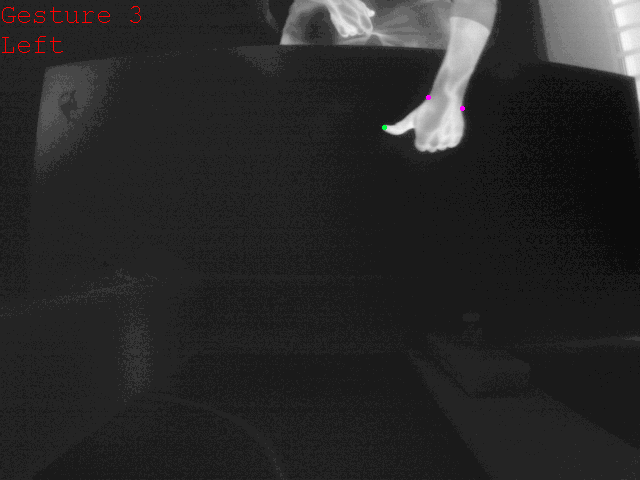

# Simultaneous prediction of hand gestures, handedness, and hand keypoints using thermal images

## Abstract
Hand gesture detection is a well-explored area in computer vision with applications in various forms of Human-Computer Interactions. In this work, we propose a technique for simultaneous hand gesture classification, handedness detection, and hand keypoints localization using thermal data captured by an infrared camera. Our method uses a novel deep multi-task learning architecture that includes shared encoder-decoder layers followed by three branches dedicated for each mentioned task. We performed extensive experimental validation of our model on an in-house dataset consisting of 24 users' data. The results confirm higher than 98% accuracy for gesture classification, handedness detection, and fingertips localization, and more than 91% accuracy for wrist points localization.

  

 

## ***Dataset***
Data captured with Viento-G thermal camera. We use background subtraction to detect binary hand regions, k-means clustering to isolate each hand, crop the image to tightly include each hand region, and resize it to a 100x100 pixel image.

### ***Raw Data***

* We have 24 users(with both left and right hand)
* Video captured in 30fps
* Saved as 16 bit  640×480 TIFF

$~~~~$ **Download from Google Drive** [HERE](https://drive.google.com/file/d/1DaoVD-vdYuS9y7XGbFRgaxQd4y2tbIgH/view?usp=share_link)

### ***Cropped Data***

**Download from Google Drive** [HERE](https://drive.google.com/file/d/1XCc8_XF3VJBpRaXtiawVCsl2Ot1vUe4J/view?usp=share_link)

## ***Dataset Distribution***

  
 

 
 

  
 

